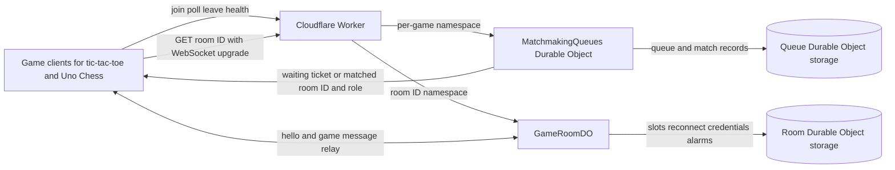

# Fuurma Matchmaking — Architecture

The Cloudflare Worker routes per-game matchmaking requests to a `MatchmakingQueues` Durable Object and room WebSocket upgrades to a `GameRoomDO` keyed by room ID. Durable Object storage owns queue, match, and room slot state; game clients keep game rules and turn state themselves.

## Modules

- `src/index.ts` — Worker HTTP routing and per-game matchmaking queue Durable Object
- `src/room.ts` — per-room WebSocket relay, reconnect lifecycle, and persistent slots
- `src/utils.ts` — validation, sanitization, CORS, JSON responses, and event logging
- `wrangler.jsonc` — Worker entry point, Durable Object bindings, and migrations
- `src/index.test.ts`, `src/room.test.ts` — queue and room behavior tests
